# ES65
### let 和 const 命令

#### let 命令
- 基本语法
  + 类似var，但只在let命令所在的代码块内有效。for循环的计数器适合用
  + 使用var的for循环：

    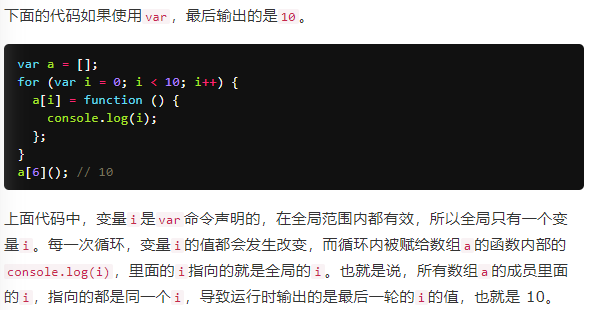  
  + 使用let的for循环：

    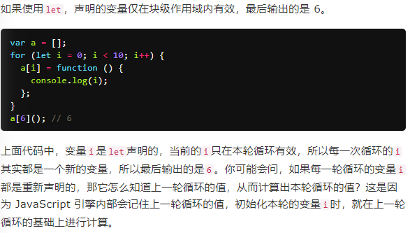
  + for循环的特别之处：设置循环变量的那部分是一个父作用域，而循环体内部是一个单独的子作用域。
- 不存在变量提升
  + var命令会发生“变量提升”现象，即变量可以在声明之前使用，值为undefined。
  + let一定要在声明后使用，否则报错。
- 暂时性死区
  + 只要块级作用域内存在let命令，它所声明的变量就“绑定”（binding）这个区域，不再受外部的影响。
  + 在代码块内，使用let命令声明变量之前，该变量都是不可用的。-----暂时性死区。
  + x使用let命令声明，在声明之前，typeof x--就会报错ReferenceError。
  + 本质:只要一进入当前作用域，所要使用的变量就已经存在了，但是不可获取，只有等到声明变量的那一行代码出现，才可以获取和使用该变量。
- let不允许在相同作用域内，重复声明同一个变量。 
#### 块级作用域
- ES5 只有全局作用域和函数作用域，没有块级作用域
  + 内层变量可能会覆盖外层变量
  + 用来计数的循环变量泄露为全局变量。
  
  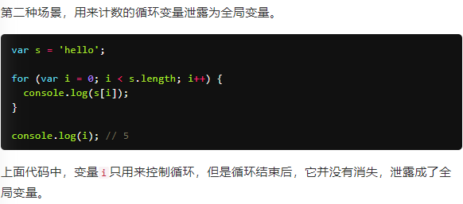
- ES6 的块级作用域
  + let实际上为 JavaScript 新增了块级作用域。 {}--作用域
  + 内层作用域可以定义外层作用域的同名变量。
  + 立即执行函数没必要。
  
  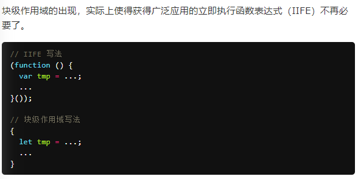
- 块级作用域与函数声明 
  + ES5 规定，函数只能在顶层作用域和函数作用域之中声明，不能在块级作用域声明。
  + ES6 引入了块级作用域，允许在块级作用域之中声明函数。
  + ES6 规定，块级作用域之中，函数声明语句的行为类似于let，在块级作用域之外不可引用。
  + 浏览器的 ES6 环境的行为方式：
  
  
  + 块级作用域内部，优先使用函数表达式，建议不要使用函数声明语句。
  + ES6 的块级作用域必须有大括号
  + let只能出现在当前作用域的顶层；严格模式下，函数只能声明在当前作用域的顶层。
#### const命令
- 基本用法
  + const声明一个只读的常量。一旦声明，常量的值就不能改变。
  + const的作用域与let命令相同：只在声明所在的块级作用域内有效。
  + const命令声明的常量也是不提升，同样存在暂时性死区，只能在声明的位置后面使用。
  + const声明的常量，也与let一样不可重复声明。
- 本质：并不是变量的值不得改动，而是变量指向的那个内存地址所保存的数据不得改动。
  + 对象冻结
  
    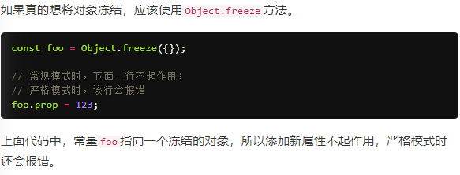
    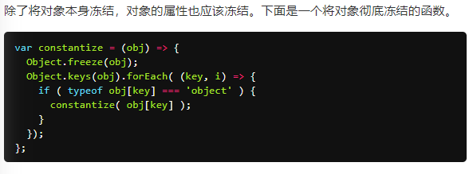
#### 顶层对象的属性
- 顶层对象：在浏览器环境指的是window对象；在 Node 指的是global对象;浏览器和 Web Worker 里面，self也指向顶层对象，但是 Node 没有self。
- ES5 之中，顶层对象的属性与全局变量是等价的
- 问题：
   + 没法在编译时就报出变量未声明的错误，只有运行时才能知道（因为全局变量可能是顶层对象的属性创造的，而属性的创造是动态的）
   + 程序员很容易不知不觉地就创建了全局变量（比如打字出错）
   + 顶层对象的属性是到处可以读写的，这非常不利于模块化编程
   + window对象有实体含义，指的是浏览器的窗口对象，顶层对象是一个有实体含义的对象，也是不合适的。
- var命令和function命令声明的全局变量，依旧是顶层对象的属性；
- let命令、const命令、class命令声明的全局变量，不属于顶层对象的属性。
- 从 ES6 开始，全局变量将逐步与顶层对象的属性脱钩。
#### 顶层对象
- 为了能够在各种环境，都能取到顶层对象，现在一般是使用this变量，但是有局限性。
  + 全局环境中，this会返回顶层对象。但是，Node 模块和 ES6 模块中，this返回的是当前模块。
  + 函数里面的this，如果函数不是作为对象的方法运行，而是单纯作为函数运行，this会指向顶层对象。但是，严格模式下，这时this会返回undefined.
  + 不管是严格模式，还是普通模式，new Function('return this')()，总是会返回全局对象。但是，如果浏览器用了 CSP（Content Security Policy，内容安全策略），那么eval、new Function这些方法都可能无法使用。
- 获取顶层对象
  ```
  // 方法一
  (typeof window !== 'undefined'
     ? window
     : (typeof process === 'object' &&
        typeof require === 'function' &&
        typeof global === 'object')
       ? global
       : this);
  
  // 方法二
  var getGlobal = function () {
    if (typeof self !== 'undefined') { return self; }
    if (typeof window !== 'undefined') { return window; }
    if (typeof global !== 'undefined') { return global; }
    throw new Error('unable to locate global object');
  };
  ```
- 引入globalThis作为顶层对象。也就是说，任何环境下，globalThis都是存在的，都可以从它拿到顶层对象，指向全局环境下的this。


   
   
### 变量的解构赋值

#### 数组的解构赋值
- 基本用法
  + 解构：ES6 允许按照一定模式，从数组和对象中提取值，对变量进行赋值。
  ```
      let [foo, [[bar], baz]] = [1, [[2], 3]];
      foo // 1
      bar // 2
      baz // 3
      
      let [ , , third] = ["foo", "bar", "baz"];
      third // "baz"
      
      let [x, , y] = [1, 2, 3];
      x // 1
      y // 3
      
      let [head, ...tail] = [1, 2, 3, 4];
      head // 1
      tail // [2, 3, 4]
      
      let [x, y, ...z] = ['a'];
      x // "a"
      y // undefined
      z // []
  ```
  + 如果解构不成功，变量的值就等于undefined。
-  解构赋值允许指定默认值。
  
      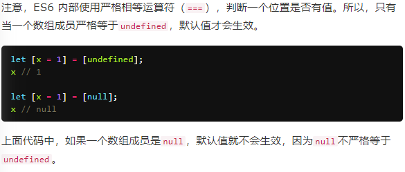 
  + 如果默认值是一个表达式，那么这个表达式是惰性求值的，即只有在用到的时候，才会求值。
  + 默认值可以引用解构赋值的其他变量，但该变量必须已经声明。
#### 对象的解构赋值
- 简介
  + 数组的元素是按次序排列的，变量的取值由它的位置决定；
  + 而对象的属性没有次序，变量必须与属性同名，才能取到正确的值。
    ```
    let { foo, bar } = { foo: 'aaa', bar: 'bbb' };
    ```
  + 如果解构失败，变量的值等于undefined。
  + 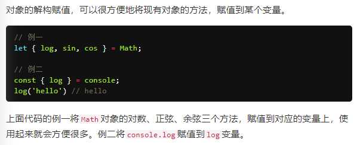 
  + 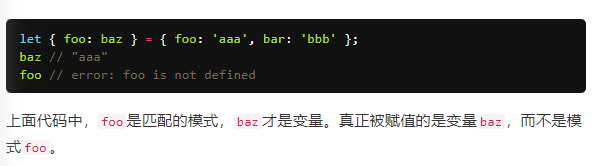 
  + 与数组一样，解构也可以用于嵌套结构的对象。
- 对象的解构也可以指定默认值。和数组差不多
- 注意点
  + 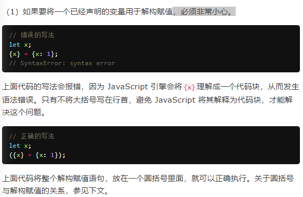
  + 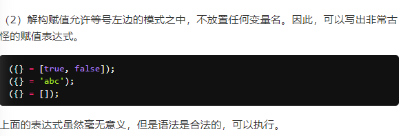
  + 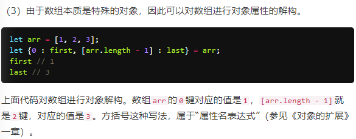
#### 字符串的解构赋值
- 字符串被转换成了一个类似数组的对象。 const [a, b, c, d, e] = 'hello';
- 类似数组的对象都有一个length属性，因此还可以对这个属性解构赋值。
    ```
    let {length : len} = 'hello';
    len // 5
    ```
#### 数值和布尔值的解构赋值
- 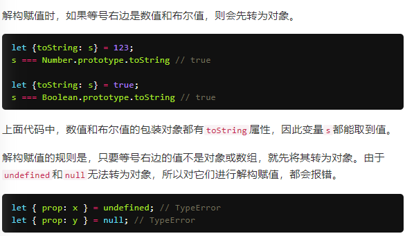
#### 函数参数的解构赋值
- 函数的参数也可以使用解构赋值。
```
    [[1, 2], [3, 4]].map(([a, b]) => a + b);
    // [ 3, 7 ]
```
#### 圆括号问题
- ES6 的规则是，只要有可能导致解构的歧义，就不得使用圆括号。
- 不能使用圆括号的情况
  + 变量声明语句
  + 函数参数
  + 赋值语句的模式
- 赋值语句的模式
  + 赋值语句的非模式部分，可以使用圆括号
  ```
        [(b)] = [3]; // 正确
        ({ p: (d) } = {}); // 正确
        [(parseInt.prop)] = [3]; // 正确
   ```
#### 用途
- 交换变量的值
  ```
      let x = 1;
      let y = 2;
      [x, y] = [y, x];
  ```
- 从函数返回多个值
  ```   
        // 返回一个数组
        function example() {
          return [1, 2, 3];
        }
        let [a, b, c] = example();
        
        // 返回一个对象
        
        function example() {
          return {
            foo: 1,
            bar: 2
          };
        }
        let { foo, bar } = example();
  ```
- 函数参数的定义
  ```
    // 参数是一组有次序的值
    function f([x, y, z]) { ... }
    f([1, 2, 3]);
    
    // 参数是一组无次序的值
    function f({x, y, z}) { ... }
    f({z: 3, y: 2, x: 1});
  ```
- 提取 JSON 数据
  
  
  
  
  
  
  
  
  
  
- var、const和let
- 变量得解构赋值
  ```
  
  1、数组
    let [a, b, c] = [1, 2, 3];
  
  
    let [head, ...tail] = [1, 2, 3, 4];
    head // 1
    tail // [2, 3, 4]
    
    let [x, y = 'b'] = ['a', undefined]; // x='a', y='b'
    
    2、对象
    let { foo: baz } = { foo: 'aaa', bar: 'bbb' };
    baz // "aaa"
    foo // error: foo is not defined
    
    let x;
    ({x} = {x: 1});已经声明的变量用于解构赋值
    
    3、字符串
    const [a, b, c, d, e] = 'hello';
    a // "h"
    b // "e"
    c // "l"
    d // "l"
    e // "o"
    
    let {length : len} = 'hello';
    len // 5
    
    4、数值和布尔值，等号右边是数值和布尔值，则会先转为对象。
    let {toString: s} = 123;
    s === Number.prototype.toString // true
    
    let {toString: s} = true;
    s === Boolean.prototype.toString // true
    
    let { prop: x } = undefined; // TypeError
    let { prop: y } = null; // TypeError
    
    5、函数参数
    function move({x = 0, y = 0} = {}) {
      return [x, y];
    }
    move({x: 3, y: 8}); // [3, 8]
    move({x: 3}); // [3, 0]
    move({}); // [0, 0]
    move(); // [0, 0]
    
    function move({x, y} = { x: 0, y: 0 }) {
      return [x, y];
    }
    move({x: 3, y: 8}); // [3, 8]
    move({x: 3}); // [3, undefined]
    move({}); // [undefined, undefined]
    move(); // [0, 0]
    
    6、圆括号问题
    只要有可能导致解构的歧义，就不得使用圆括号。
    let {x: (c)} = {};//报错，变量声明语句，模式不能使用圆括号。
    function f([z,(x)]) { return x; }    // 报错，函数参数也属于变量声明，因此不能带有圆括号。
    ({ p: a }) = { p: 42 };//报错，赋值语句的模式，将整个模式放在圆括号之中，导致报错。
    [({ p: a }), { x: c }] = [{}, {}];//报错，赋值语句的模式，将一部分模式放在圆括号之中，导致报错。
    
    7、可以使用圆括号的情况 -----赋值语句的非模式部分，可以使用圆括号。
    [(b)] = [3]; // 正确
    ({ p: (d) } = {}); // 正确
    [(parseInt.prop)] = [3]; // 正确， 都是赋值语句，而不是声明语句；其次它们的圆括号都不属于模式的一部分
    
    
  ```  
- 字符串得扩展
  + "\u{20BB7}"    // "𠮷"
  + 字符串循环遍历：for...of
  ```
  for (let codePoint of 'foo') {
    console.log(codePoint)
  }
  // "f"
  // "o"
  // "o"

  ```